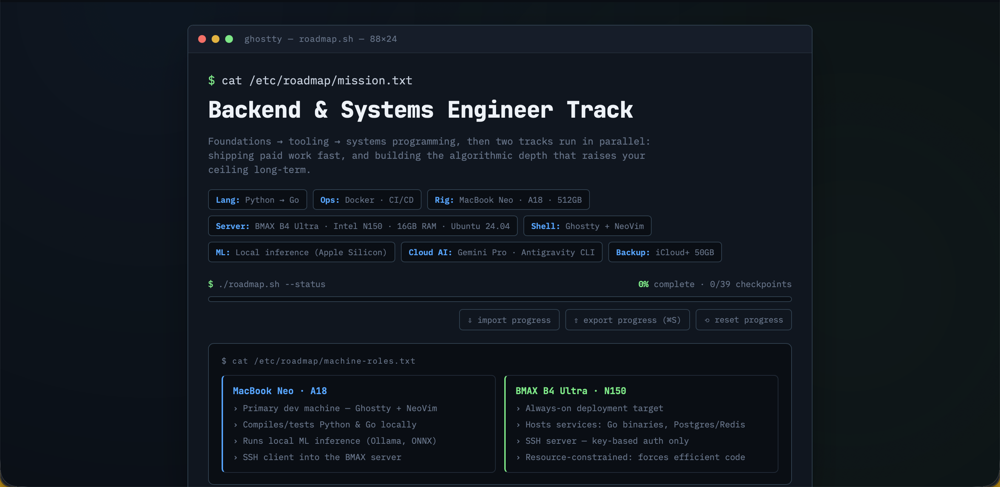

# Backend & Systems Engineer Roadmap

A self-tracked learning dashboard for progressing from programming fundamentals to a
professional backend/systems engineer, structured around a curated reading list
(MIT 6.100L, MIT's Missing Semester, A Tour of Go, MIT 6.006) plus applied DevOps work.

**[Open the live tracker →](./index.html)** (download and open locally — see below)

## Why this exists

Most learning roadmaps are linear: finish theory, then go build things. This one
deliberately isn't. It's split into two tracks that run in parallel once the
fundamentals are done:

- **Foundation track** (sequential) — core Python, dev tooling, Go fundamentals.
  No skipping ahead; each stage is a prerequisite for the next.
- **Income track** — deployment, Docker, a real shipped project, freelance positioning.
  Goal: get paid sooner rather than later.
- **Ceiling track** — MIT 6.006 algorithms, distributed systems theory, system design
  interview prep. Goal: stay competitive for high-tier roles over a multi-year horizon.

The income and ceiling tracks unlock together once the foundation stages are complete,
so progress on "get paid" and "get good enough for big tech" happen side by side
instead of one blocking the other.

## Features

- Five-stage pipeline view with per-checkpoint progress tracking
- Capstone checkpoints flagged as portfolio-worthy artifacts
- Local persistence via `localStorage` — progress survives page reloads
- **Export/import progress as JSON** — back up your progress or move it between
  machines/browsers without losing anything

## Usage

1. Download `index.html`
2. Open it in any modern browser — no server, no build step, no dependencies
3. Click checkpoints as you complete them
4. Periodically click **export progress** to save a timestamped backup JSON
   (keep these in this repo under `/backups` if you want full history)

## Stack this roadmap is built for

Python → Go, DevOps on Ubuntu 24.04, terminal-centric workflow (Ghostty + NeoVim),
local ML inference on Apple Silicon, deployed against a home server.

## Status

Living document — checkpoints and structure may evolve as the plan does.
